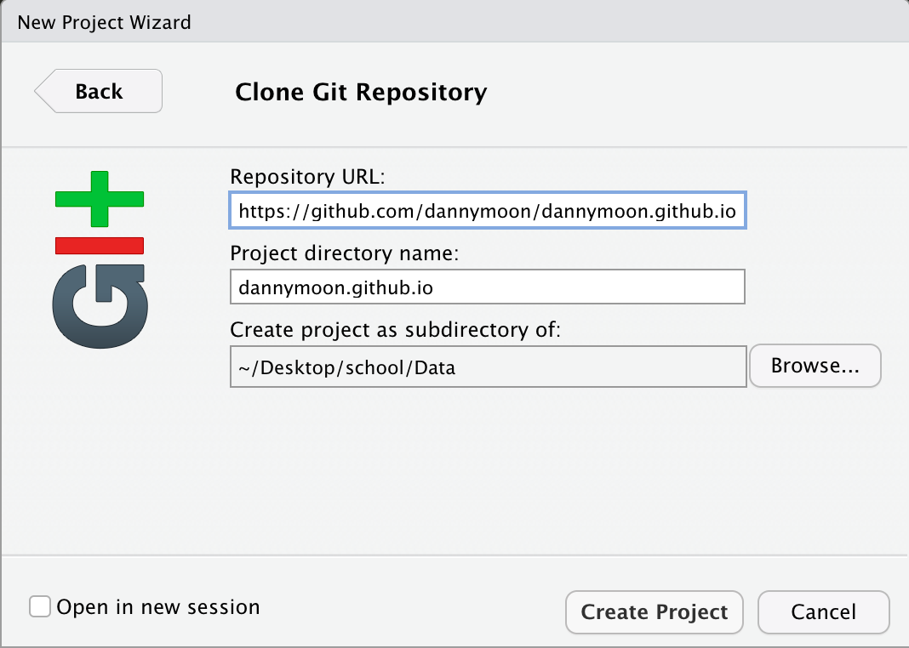

As part of the senior project, I had to create a blog. There are many different tools that you could use to create a blog, but I chose `distill` package in R to create my blog. I would like to show how I created this blog using distill package in R with github. This post will show you very basic of creating a blog and a blog post.

First, open up R studio and install `distill` package.

```{r eval=FALSE}
install.packages("distill")
```


Next, go to `github.com` and create a repo. Name your repo name as `your_github_userid.github.io`. My example shows invalid because I already have my repo named in that convention. 


After you create your repo, copy the url of your repo and open R Studio again.


In R Studio, create a new project. When creating a new project, choose `version control` and choose `git` options.


Paste the URL of your repo and select the directory that you want to save your file.




After the project is created, run the following command to create a blog using `distill` package.

```{r eval=FALSE}
distill::create_blog(dir = getwd(), title = "your blog name")
```

`dir` command let you choose where you want to create a blog. In this case, I'm creating a blog file to my current working directory and that is why I'm using `getwe()`. Name your blog in `title`.

After you run the command and the blog files are created, you need to quit and restart the R studio.

After you restart your R studio, you can find a `Build` tab on your right upper side panel of R Studio. Click `Build` tab and click `Build Website`. 

When it's done, go to `Files` and find `_site.yml` and open it. 

Change the `output_dir` from `site` to `docs`.

Then, push everything to github. After you push it to your github, go to your repo and click `Settings`.

Under settings, go to `pages`. Under `Source` change None to `master`. Change `root` to `docs` and click save. Then you will see something like this. 


Copy the url of your site that is shown in the above image and go to `_site.yml` in R Studio. Under the `output_dir` add a line and type `base_url:` and paste the url of yoru site. Save the `_site.yml`. 

Now let's create a new blog post. Run the following command in your console.

```{r, eval=FALSE}
distill::create_post("creating a blog")
```

You will see a Rmd file with the name you just named for your post. I assume you are familiar with Rmd files and won't explain much about editing your yml of Rmd. Edit yml of your Rmd file so it shows your name and correct url and etc.

Once you are done with editing your post, knit your Rmd file. Go to `Build` tab and click `Build Website` again. Then push everything to github. Now you can see your blog post if you go to your website's url.


Go to main page of your repo and click the gear button next to the `about` section. You can add a description of your repo and paste your website's url under `website` field and save changes.


You have to do this process (knitting your rmd file, build website, and push it to github) whenever you create a new post. You can changed the theme of your Rmd file to change the theme of your blog and post. For more information about `distill` package, please visit `https://rstudio.github.io/distill`.

