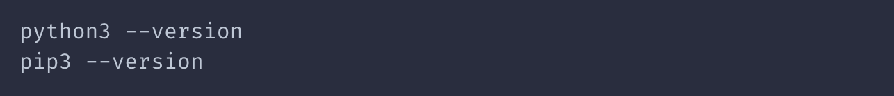
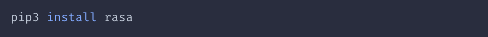

In this post, I'll show you a basic set up tutorial of setting up RASA opensource on your local machine. I'm using mac OS, so it can be little different for Window users.

## 1. Python Environment Setup

First, `python3` and `pip3` are required to follow the instructions. If you have both of them, make a directory where you want to save all your chatbot files. From the directory, open a terminal. 

Check if your Python environment is already configured.

If these packages are already installed, these commands should display version numbers for each step, and you can skip to the next step.

## 2. Virtual Environment Setup

We don't want to install packages for this project system-wide, so we will install packages for this project in a virtual environment. Reason for this is that we might want to run different versions of packages for different projects. They also let you install packages without root privileges.

Create a new virtual environment by choosing a Python interpreter and making a `./venv` directory to hold it.

Activate the virtual environment.

## 3. Install Rasa Open Source

Once this is done, you can run `rasa init` to initiate a rasa project.

You can find more detailed instructions of installation here.
https://rasa.com/docs/rasa/installation/